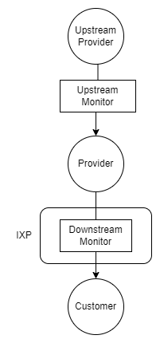

Bandwidth Monitor
=================

The bandwidth monitor counts the number of bytes forwarded between two SCION ASes. Counts are
grouped by the ingress and egress interface pair found in the hop field.


Contract Monitoring
-------------------
To monitor ESDX contract fulfillment, an instance of the bandwidth monitor is placed on either side
of the provider AS as a 'bump in the wire'. We refer to the instance on the upstream provider side
as upstream monitor and the instance on the side of the customer AS as downstream monitor. The
upstream and downstream monitors parse the path header of all (SCION) packets passing through them
and extract the hop field belonging to the provider hop. The ingress and egress interface IDs in the
provider hop field uniquely identify any active ESDX contract of the provider.



The monitors count and log the number of bytes forwarded for each interface pair. The logs can be
used to proof that:
1. The customer AS did not use more bandwidth than agreed upon on any path enabled by the contract.
2. The provider AS delivered the guaranteed bandwidth between the IXP and the upstream interfaces.


Development
-----------
Make sure the `libbpf` submodule is initialized, as we need some libbpf headers to compile the BPF
part of the monitor. Since we only need the headers, it is not necessary to build libbpf.

Compile the BPF/XDP code and generate Go bindings:
```bash
go generate
```

Build the host application:
```bash
go build
```

There is an example SCION topology mirroring the figure above in [test/topology](./test/topology).
It requires Docker and docker-compose, as well as a copy of
[SCION](https://github.com/netsec-ethz/scion) and
[SCION-Apps](https://github.com/netsec-ethz/scion-apps).

Set environment variables `SCION_ROOT` (default: `$HOME/scion`) and `SCION_APPS`
(default: `$HOME/scion-apps`) to point to the SCION and scion-apps source trees, respectively.

The topology can be run by typing
```bash
cd test/topology
./test_topo run
```

The monitor log files are stored in `test/topology/log`.
